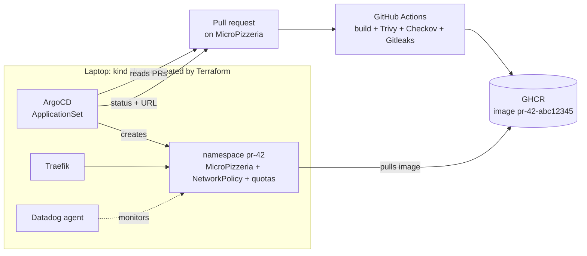

# PRVue

**An ephemeral preview environment for every pull request.**

PRVue is a platform that automatically spins up a complete, isolated copy of the [MicroPizzeria](https://github.com/sana-Benz/MicroPizzeria) application in Kubernetes for each of its pull requests. The copy is health-checked, monitored, and deleted when the PR is closed.

> 🚧 **Work in progress.** See the [project status](#project-status).

---

## The problem

When someone proposes a change to an application, the team wants to **see it running** before merging it. Without tooling, that version has to be deployed somewhere by hand: it is slow, error-prone, and test versions end up stepping on each other.

## The solution

With PRVue, you only need to open a pull request with the `preview` label:

1. CI builds the application images and scans them (vulnerabilities, infrastructure misconfigurations, secrets).
2. ArgoCD detects the PR and deploys the application into a dedicated namespace, `pr-<number>`.
3. A health check verifies that the environment responds, then the URL is posted on the PR: `http://pr-42.127.0.0.1.nip.io`.
4. Datadog monitors the memory, CPU and logs of each environment.
5. When the PR is closed, the environment is **deleted automatically**.

## Architecture



**Every connection is outbound from the laptop; nothing comes in.** ArgoCD polls GitHub and the cluster pulls images. Nothing is exposed to the Internet, and port 80 only listens on `127.0.0.1`.

### Two repositories, two roles

| Repository | Content | Role |
| --- | --- | --- |
| [MicroPizzeria](https://github.com/sana-Benz/MicroPizzeria) | The application: Nginx frontend, Flask `user-service` and `order-service`, two MySQL databases | PRs opened here trigger the previews |
| **PRVue** (this repo) | The platform: Terraform, ArgoCD | Builds the foundation and creates one environment per PR |

This split mirrors how companies work: a platform team provides the tooling, and application teams use it.

## Tech stack

| Tool | Role in PRVue | Why this choice |
| --- | --- | --- |
| **kind** | Local Kubernetes cluster (nodes are Docker containers) | Free, lightweight, manageable with Terraform |
| **Terraform** | Creates and destroys the foundation with a single command | Infrastructure as Code: an identical, reproducible foundation |
| **Helm** | Installs Traefik and ArgoCD (through Terraform) | Ready-made packages with pinned versions |
| **Traefik** | Ingress controller: routes each URL to the right environment | Lightweight and maintained; the ingress-nginx project was retired by Kubernetes in 2026 |
| **ArgoCD** | GitOps: creates and deletes one environment per PR (*Pull Request* generator) | *Pull* model: the cluster fetches the desired state from Git, no inbound access needed |
| **GitHub Actions** | CI: build, scans, image publishing | Built into GitHub, free for public repositories |
| **Trivy / Checkov / Gitleaks** | Blocking scans: images, IaC, secrets | Security built into the pipeline (*shift left*) |
| **Datadog** | Per-environment metrics, logs and alerts | Student offer, observability filterable by namespace |

## Security

✅ = in place, ⏳ = planned.

- ✅ **Network**: the cluster only listens on `127.0.0.1`, so it cannot be reached from the local network.
- ✅ **Secrets**: never stored in the repository. The Terraform state, `*.tfvars` files and the kubeconfig are excluded by `.gitignore`. Secrets will be passed to Terraform through environment variables (`TF_VAR_...`).
- ✅ **Protected `main` branch** on MicroPizzeria: no force push, no deletion, changes must go through a PR.
- ⏳ **Isolation**: each environment will get its own namespace, *deny-by-default* NetworkPolicies (one environment cannot reach another) and resource quotas.
- ⏳ **Defense in depth against secret leaks**: `.gitignore`, a local Gitleaks pre-commit hook, then Gitleaks in CI.
- ⏳ **Pipeline**: images scanned by Trivy (blocking on `CRITICAL`/`HIGH`), IaC scanned by Checkov, third-party actions pinned to a commit SHA.

## Project status

| Step | Content | Status |
| --- | --- | --- |
| 1 | Local foundation: kind cluster, Traefik and ArgoCD with Terraform | ✅ |
| 2 | MicroPizzeria Kustomize manifests, NetworkPolicies, quotas | ⏳ |
| 3 | CI: build, Trivy, Checkov, Gitleaks, publishing to GHCR | ⏳ |
| 4 | One environment per PR with an ArgoCD ApplicationSet | ⏳ |
| 5 | Post-deployment health check and PR feedback (status + URL) | ⏳ |
| 6 | Datadog observability: per-environment dashboard and alerts | ⏳ |
| 7 | Measurements, architecture decision records (ADRs), runbook, demo video | ⏳ |

**Planned extensions**: secrets with Doppler, cleanup of idle environments, AWS Terraform on LocalStack, Azure AKS demo, LLM review of the Terraform plan.

## Getting started

What works today: the local foundation.

**Prerequisites**: Docker, kind, kubectl, Terraform, Helm.

```bash
cd platform/terraform
terraform init
terraform apply          # creates the "previews" kind cluster, then installs Traefik and ArgoCD

kubectl get pods -A      # every pod should be Running
curl http://localhost    # "404 page not found": Traefik answers, no application is deployed yet

terraform destroy        # removes everything
```

## Repository layout

```
.
├── platform/
│   └── terraform/
│       ├── providers.tf    # kind and helm providers
│       ├── cluster.tf      # "previews" kind cluster, port 80 → 30080
│       ├── platform.tf     # Traefik and ArgoCD (Helm charts, pinned versions)
│       └── values/         # chart settings
├── GUIDE.md                # detailed project roadmap (French)
└── AVANCEMENT.md           # progress log: what was done, and why (French)
```

Coming next: `platform/argocd/applicationset.yaml`, `.github/workflows/`, `docs/adr/` (decision records) and `docs/runbook.md`.

## Measurements

To be collected in step 7:

| Measurement | Value |
| --- | --- |
| Foundation creation time (`terraform apply` from scratch) | TBD |
| Time from PR opened to environment ready | TBD |
| Teardown time after the PR is closed | TBD |
| RAM per environment | TBD |
| Cost | **€0** |
